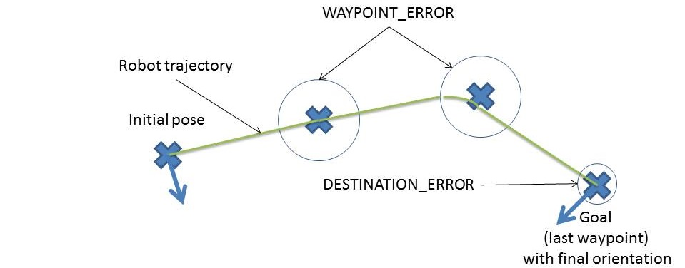
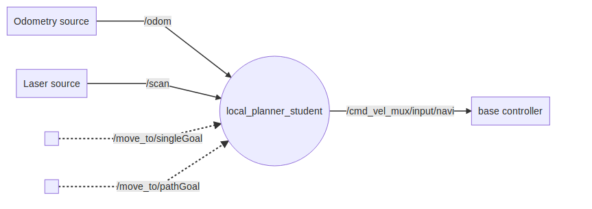
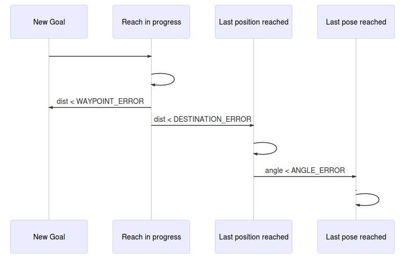

# local_planner_student

Le but de ce TP est de coder un "local planner" sur la base du template fourni : [localPlanner_student.py](/script/localPlanner_student.py)

|  |
|:-------:|
| *local_planner_student basic principle for a differential drive robot like turtlebot* |


Ce "local planner" fonctionne (une fois complété) avec un robot (à base différentielle) fournissant les topics `/odom` et `/scan` et se déplaçant en velocité selon le topic `cmd_vel_mux/input/navi` :

<!---
graph LR
    T1[Odometry source] -- /odom --TO_REMOVE> Node((local_planner_student))
    T2[Laser source] -- /scan --TO_REMOVE> Node((local_planner_student))

    S1[ ] -. /move_to/singleGoal .-> Node
    S2[ ] -. /move_to/pathGoal .-> Node

    Node -- /cmd_vel_mux/input/navi --TO_REMOVE>D[base controller]
-->
 

Le turtelbot est tout trouvé pour cet usage. L'utilisation d'un simulateur facilitera la réalisation du TP. Je vous propose d'utiliser le turtlebot dans le simulateur stage: 
```{r, engine='bash', count_lines} 
roslaunch turtlebot_stage turtlebot_in_stage.launch
```

Pour piloter le robot, votre noeud doit pouvoir traiter les 2 services suivants (**Les services sont codés, mais c'est à vous de coder la prise en charge des données inscrites dans self.pathPoses en suivant les #TODO dans le code**):
+ un Goal sur `/move_to/singleGoal`
  - Ce service recoit un message `goalPose2D` de type `geometry_msgs/Pose2D` et répond le message `possible` de type `std_msgs/Bool` donnant la faisabilité de la consigne demandée.  Voir fichier [localGoal.srv](/srv/localGoal.srv)
  - La consigne `goalPose2D` est exprimée en absolue dans le repère de la TF odom
  - Le plus simple pour appeler ce service est d'utiliser la commande suivante :
    ```{r, engine='bash', count_lines} 
    rosservice call /move_to/singleGoal '[0.0, 0.0, 0.0]'
    ```
+ un Path sur `/move_to/pathGoal`
  - Ce service reçoit un message `pathToGoal` de type `nav_msgs/Path` et répond le message `success` de type `std_msgs/Bool` renseignant le succès ou l'échec de l'execution de la trajectoire demandée. Voir fichier [Path.srv](/srv/Path.srv)
  - Le message étant long et difficile à écrire en console, utilisez le noeud path_generator fourni avec le template. 
      ```{r, engine='bash', count_lines} 
      rosrun local_planner_student testPathGenerator.py
      ```
      Le code source du générateur se trouve dans le fichier [testPathGenerator.py](/script/testPathGenerator.py)
  - La consigne `pathToGoal` est exprimée en absolue dans n'importe quel repère à définir dans `header.frame_id` . Dans le cas du générateur, le `frame_id` envoyé est celui de la `/map`. **Attention** : A sa reception, la pose devra être convertie dans le repère de la TF odom. Cela peut se faire en une ligne avec la méthode transformPose de la lib tf.TransformListener()

Pour évaluer le déplacement et l'environnement proche, votre noeud doit s'abonner aux 2 topics suivants :
+ /scan pour vérifier qu'il n'y ait pas d'obstacle
  - Pour faire simple, si un des points du laser a un obstacle à moins d'une valeur défini en ROSPARAM lors de l'execution d'un service, on considère qu'un obstacle empêche le succès de ce service. On affichera un log avec la distance de l'obstacle ainsi que l'angle de sa detection, une fois sur 100
+ /odom pour connaitre la position relative du robot par rapport à la tf odom


Pour déplacer le robot, vous devrez publier un topic de commande en velocité:
+ `/cmd_vel_mux/input/navi` de type twist pour piloter le robot en vitesse
  - Merci d'utiliser à cet effet les ROSPARAM `SAT_LINEAR` et `SAT_ANGULAR` passés au contructeur de localPlanner. Inspirez-vous ce qui est déjà fait avec `K_LINEAR`, `K_ANGULAR`. 
  - Prenez en compte aussi ANGLE_TO_ALLOW_LINEAR qui est un angle en radian au-dessus duquel on n'authorise pas de mouvement linéaire.


<!---
sequenceDiagram
    participant New Goal
    participant Reach in progress
    participant Last  position reached
    participant Last  pose reached
    New Goal->>Reach in progress: 
    Reach in progress->>Reach in progress: 
    Reach in progress->>New Goal:  dist < WAYPOINT_ERROR
    Reach in progress->>Last  position reached:  dist < DESTINATION_ERROR
    Last  position reached->>Last  position reached:  
    Last  position reached->>Last  pose reached:  angle < ANGLE_ERROR
    Last  pose reached->>Last  pose reached : .

-->
Machine d'état permettant de passer d'un waypoint à un autre :

 
 


**Beaucoup de code est déjà fonctionnel. Complétez le template. Des commentaires "#TODO" indique dans les grandes lignes ce qu'il faut faire. Il est possible également de refaire tout le code.
Commencez par les callbacks, puis par déplacer le robot pour 1 seul Target. Lorque le progrmamme fonctionne bien avec le service /move_to/singleGoal , ajoutez la fonctionnalité du Path. Pour finir veillez à l'orientation finale**
